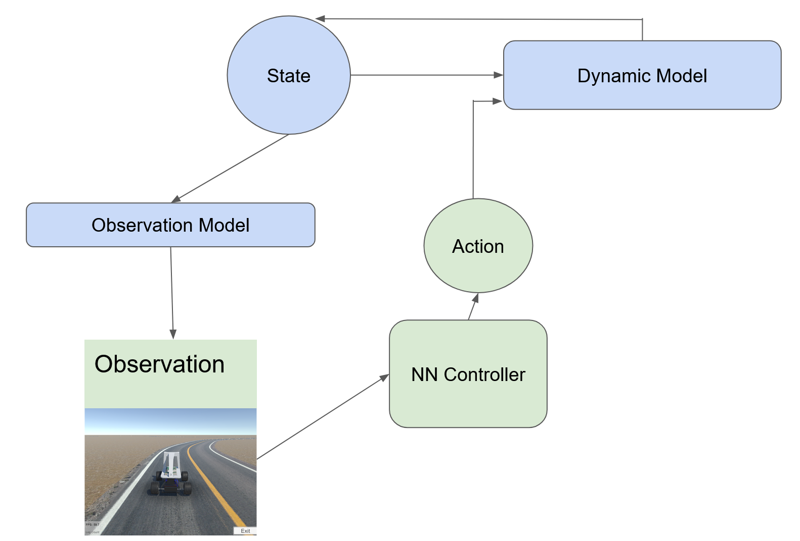

# Image-based-Control

1. Install the requirement (see the txt file)

2. Download the simulator of donkey car from https://github.com/tawnkramer/gym-donkeycar/releases/tag/v22.11.06

DonkeySimLinux.zip

291 MB 2022-11-06T00:05:53Z

DonkeySimMac.zip

239 MB 2022-11-06T00:05:26Z

DonkeySimWin.zip

227 MB

3. Run the Simulator

4. The code shows 500 of the donkey car Cross-Track-Error test with an NN controller

5. Print the average CTE error over steps

The dynamic flow is:

